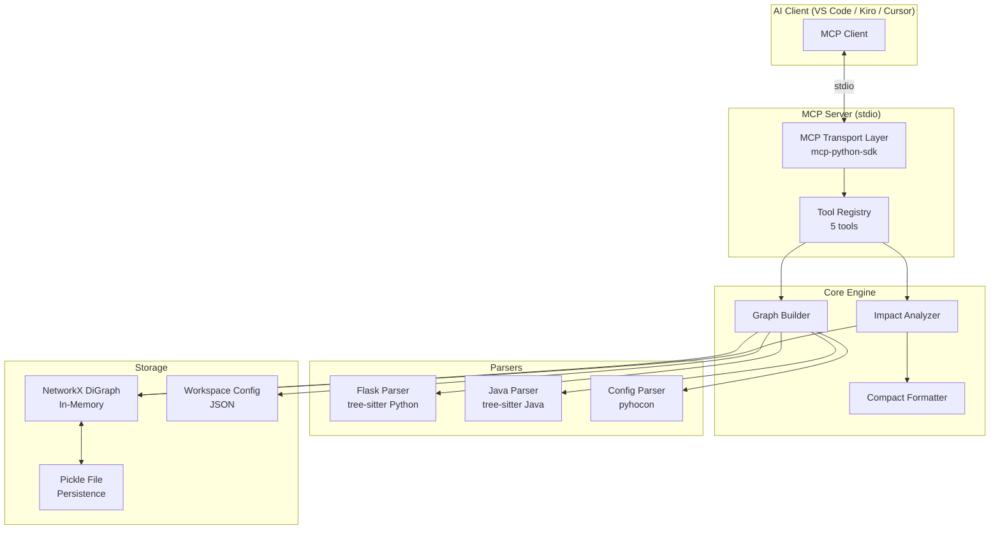
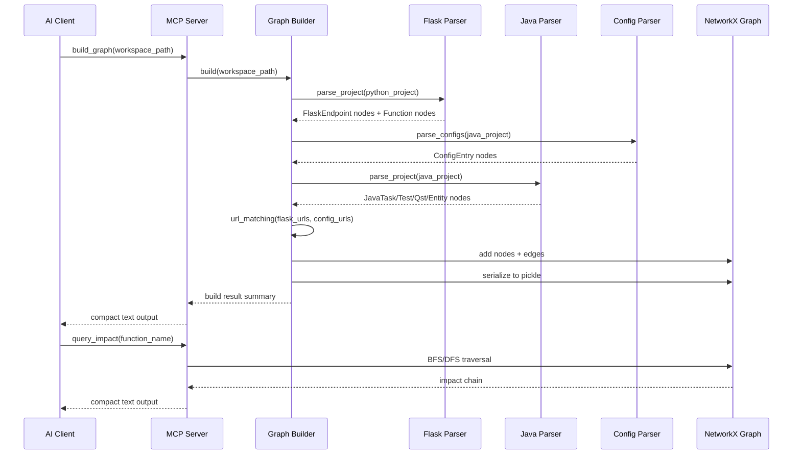
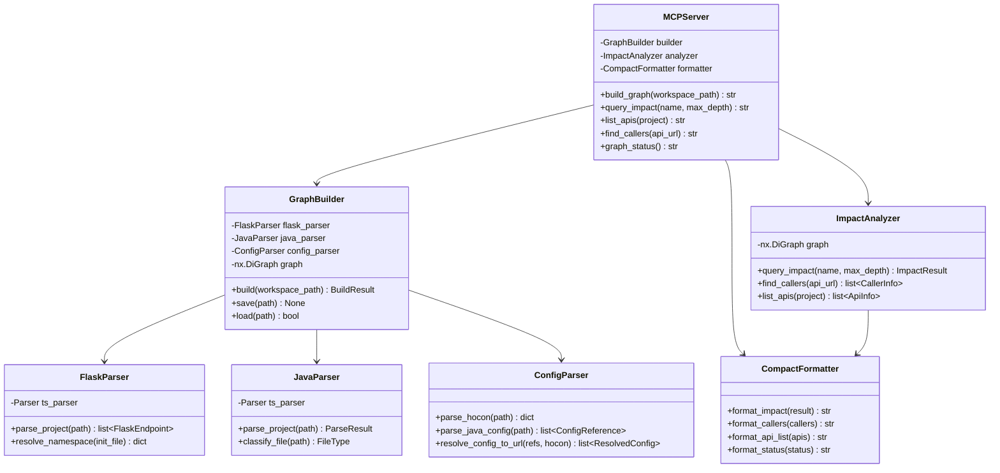

# Tài liệu Thiết kế: KG Multi-Project MCP

## Tổng quan (Overview)

Hệ thống là một MCP Server chạy local qua stdio transport, cung cấp khả năng phân tích tác động API xuyên dự án (cross-project API impact analysis) cho workspace đa dự án Python Flask + Java Serenity BDD. Server xây dựng một Knowledge Graph (đồ thị có hướng) bằng NetworkX, trong đó các node đại diện cho các thành phần code (endpoint, function, test, task, entity...) và các edge đại diện cho mối quan hệ giữa chúng. AI client (VS Code/Kiro/Cursor) giao tiếp với server qua 5 tool MCP để build graph, truy vấn tác động, liệt kê API, tìm caller, và kiểm tra trạng thái.

### Quyết định kỹ thuật chính

| Quyết định | Lựa chọn | Lý do |
|---|---|---|
| Runtime | Python 3.10+ | Phiên bản tối thiểu do mcp-python-sdk yêu cầu >=3.10 |
| AST Parsing | py-tree-sitter + grammar Python/Java | Phân tích chính xác cấu trúc code, không phụ thuộc regex |
| Config Parsing | pyhocon | Thư viện Python duy nhất hỗ trợ HOCON format đầy đủ |
| Graph Engine | NetworkX | In-memory directed graph, API trực quan, hỗ trợ BFS/DFS sẵn |
| Persistence | pickle | Serialize/deserialize NetworkX graph nhanh, không cần schema |
| MCP Protocol | mcp-python-sdk (stdio) | SDK chính thức, stdio transport đơn giản nhất cho AI client |
| Output Format | Compact text | Tối ưu token cho LLM context window, dễ đọc hơn JSON |
| Cross-Platform | pathlib + platformdirs | Xử lý path separator và cache directory đúng trên mọi OS |

## Kiến trúc (Architecture)

### Sơ đồ kiến trúc tổng thể



### Luồng xử lý chính



### Tầng kiến trúc (Architecture Layers)

1. **Transport Layer**: MCP Server (stdio) - nhận/trả request từ AI client
2. **Tool Layer**: 5 tool đăng ký theo giao thức MCP (build_graph, query_impact, list_apis, find_callers, graph_status)
3. **Parser Layer**: 3 parser độc lập (Flask, Java, Config) - mỗi parser chịu trách nhiệm một loại source
4. **Graph Layer**: NetworkX DiGraph - lưu trữ in-memory, URL matching, persistence
5. **Query Layer**: Impact Analyzer - BFS/DFS traversal, compact output formatting


## Thành phần và Giao diện (Components and Interfaces)

### 1. MCP Server (`server.py`)

Entry point của hệ thống. Đăng ký 5 tool và xử lý stdio transport.

```python
# Tool signatures
async def build_graph(workspace_path: str) -> str
async def query_impact(name: str, max_depth: int = 10) -> str
async def list_apis(project: str | None = None) -> str
async def find_callers(api_url: str) -> str
async def graph_status() -> str
```

### 2. Flask Parser (`parsers/flask_parser.py`)

Phân tích dự án Python Flask bằng tree-sitter.

```python
class FlaskParser:
    def __init__(self, tree_sitter_parser: Parser)
    def parse_file(self, file_path: Path) -> list[FlaskEndpoint]
    def resolve_namespace(self, init_file: Path) -> dict[str, str]
    def parse_project(self, project_path: Path) -> list[FlaskEndpoint]
    def extract_internal_calls(self, func_node: Node) -> list[FunctionCall]
```

Trách nhiệm:
- Phát hiện decorator: `@app.route()`, `@appWT.route()`, `@appWN.route()`, `@api.route()`, `@apiInt.route()`
- Giải quyết namespace từ `add_namespace()` trong `__init__.py`
- Kết hợp namespace path + route path → full URL
- Trích xuất internal function call chain

### 3. Java Parser (`parsers/java_parser.py`)

Phân tích dự án Java Serenity BDD bằng tree-sitter.

```python
class JavaParser:
    def __init__(self, tree_sitter_parser: Parser)
    def parse_file(self, file_path: Path) -> list[JavaNode]
    def parse_project(self, project_path: Path) -> ParseResult
    def extract_method_calls(self, class_node: Node) -> list[MethodCall]
    def classify_file(self, file_path: Path) -> FileType | None
```

Trách nhiệm:
- Phân loại file theo pattern: `*Test.java`, `*Task.java`, `*Qst.java`, `*Entity.java`
- Trích xuất method call chain: Test → Task → Qst → Entity
- Bỏ qua file không khớp pattern

### 4. Config Parser (`parsers/config_parser.py`)

Phân tích file HOCON và Java Config.

```python
class ConfigParser:
    def __init__(self)
    def parse_hocon(self, conf_path: Path) -> dict[str, str]
    def parse_java_config(self, java_file: Path) -> list[ConfigReference]
    def resolve_config_to_url(self, references: list[ConfigReference], hocon_map: dict) -> list[ResolvedConfig]
```

Trách nhiệm:
- Parse file `.conf` bằng pyhocon → key-value map
- Trích xuất `conf.getString("key")` từ `*Config.java` bằng tree-sitter
- Ánh xạ config key → URL endpoint

### 5. Graph Builder (`graph/builder.py`)

Xây dựng và quản lý Knowledge Graph.

```python
class GraphBuilder:
    def __init__(self)
    def build(self, workspace_path: Path) -> BuildResult
    def add_flask_endpoints(self, endpoints: list[FlaskEndpoint]) -> None
    def add_java_nodes(self, parse_result: ParseResult) -> None
    def add_config_entries(self, configs: list[ResolvedConfig]) -> None
    def link_by_url(self) -> int  # returns number of cross-project links
    def save(self, path: Path) -> None
    def load(self, path: Path) -> bool
```

Trách nhiệm:
- Orchestrate 3 parser
- Tạo node/edge trong NetworkX DiGraph
- URL exact matching giữa FlaskEndpoint và ConfigEntry
- Serialize/deserialize graph bằng pickle

### 6. Impact Analyzer (`graph/analyzer.py`)

Truy vấn đồ thị và format output.

```python
class ImpactAnalyzer:
    def __init__(self, graph: nx.DiGraph)
    def query_impact(self, name: str, max_depth: int = 10) -> ImpactResult
    def find_callers(self, api_url: str) -> list[CallerInfo]
    def list_apis(self, project: str | None = None) -> list[ApiInfo]
    def suggest_similar(self, name: str, threshold: float = 0.6) -> list[str]
```

### 7. Compact Formatter (`output/formatter.py`)

Format kết quả thành compact text cho LLM.

```python
class CompactFormatter:
    @staticmethod
    def format_impact(result: ImpactResult) -> str
    @staticmethod
    def format_callers(callers: list[CallerInfo]) -> str
    @staticmethod
    def format_api_list(apis: list[ApiInfo]) -> str
    @staticmethod
    def format_status(status: GraphStatus) -> str
```

### Sơ đồ quan hệ giữa các thành phần



## Mô hình Dữ liệu (Data Models)

### Node Types

```python
from dataclasses import dataclass, field
from enum import Enum
from pathlib import Path
from datetime import datetime

class NodeType(Enum):
    PROJECT = "Project"
    FILE = "File"
    FUNCTION = "Function"
    FLASK_ENDPOINT = "FlaskEndpoint"
    CONFIG_ENTRY = "ConfigEntry"
    JAVA_TASK = "JavaTask"
    JAVA_TEST = "JavaTest"
    JAVA_QST = "JavaQst"
    JAVA_ENTITY = "JavaEntity"

class EdgeType(Enum):
    DEFINES = "defines"           # Project/File → Function/Endpoint
    HANDLES = "handles"           # Function → FlaskEndpoint
    CALLS_API = "calls_api"       # ConfigEntry → FlaskEndpoint (URL match)
    TEST_CALLS = "test_calls"     # JavaTest → JavaTask
    RESOLVES_TO = "resolves_to"   # JavaTask → ConfigEntry
    USES_ENTITY = "uses_entity"   # JavaQst → JavaEntity
    CALLED_BY = "called_by"       # JavaTask → JavaQst (reverse)

class FileType(Enum):
    TEST = "Test"
    TASK = "Task"
    QST = "Qst"
    ENTITY = "Entity"
    CONFIG = "Config"
```

### Data Classes

```python
@dataclass
class FlaskEndpoint:
    function_name: str
    file_path: str
    line_number: int
    http_method: str
    route_path: str
    full_url: str
    namespace: str | None = None

@dataclass
class JavaNode:
    class_name: str
    file_path: str
    file_type: FileType
    methods: list[MethodInfo] = field(default_factory=list)

@dataclass
class MethodInfo:
    name: str
    line_number: int
    calls: list[str] = field(default_factory=list)  # method names called

@dataclass
class ConfigReference:
    java_file: str
    config_key: str
    line_number: int

@dataclass
class ResolvedConfig:
    config_key: str
    resolved_url: str
    conf_file: str
    java_file: str
    line_number: int

@dataclass
class FunctionCall:
    caller: str
    callee: str
    file_path: str
    line_number: int
```

### Graph Node Attributes

Mỗi node trong NetworkX DiGraph có các attribute sau:

```python
# Node ID format: "{node_type}:{unique_identifier}"
# Ví dụ: "FlaskEndpoint:GET:/api/v1/user/get_user"
#         "JavaTest:UserTest"
#         "File:python-svc/controllers/user_controller.py"

node_attrs = {
    "type": NodeType,          # loại node
    "name": str,               # tên hiển thị
    "file_path": str,          # đường dẫn file
    "line_number": int,        # số dòng (nếu có)
    "project": str,            # tên dự án chứa node
    "metadata": dict,          # thông tin bổ sung tùy loại node
}

# Metadata theo loại node:
# FlaskEndpoint: {"http_method": "GET", "full_url": "/api/v1/...", "namespace": "..."}
# JavaTask: {"methods": [...], "config_refs": [...]}
# ConfigEntry: {"config_key": "...", "resolved_url": "..."}
```

### Graph Edge Attributes

```python
edge_attrs = {
    "type": EdgeType,          # loại edge
    "source_line": int,        # dòng code tạo ra quan hệ
    "metadata": dict,          # thông tin bổ sung
}
```

### Persistence Models

```python
@dataclass
class GraphState:
    graph: nx.DiGraph
    version: str               # phiên bản schema
    build_time: datetime
    projects: list[str]
    workspace_path: str

@dataclass
class BuildResult:
    success: bool
    node_counts: dict[str, int]   # {NodeType.value: count}
    edge_counts: dict[str, int]   # {EdgeType.value: count}
    cross_project_links: int
    build_duration_seconds: float
    errors: list[str]
    warnings: list[str]

@dataclass
class ImpactResult:
    source_name: str
    source_url: str | None
    source_file: str
    source_line: int
    chains: list[ImpactChain]
    summary: ImpactSummary

@dataclass
class ImpactChain:
    steps: list[ImpactStep]

@dataclass
class ImpactStep:
    name: str
    file_path: str
    line_number: int
    edge_type: str

@dataclass
class ImpactSummary:
    total_files: int
    total_projects: int
    max_depth: int

@dataclass
class GraphStatus:
    is_built: bool
    node_counts: dict[str, int] | None
    edge_counts: dict[str, int] | None
    last_build_time: datetime | None
    projects: list[str]
    pickle_size_bytes: int | None
    pickle_save_time: datetime | None
```

### Compact Output Format

Tất cả 5 tool trả về plain text tối ưu cho LLM context window. Không dùng JSON. Mỗi dòng mang đúng 1 ý nghĩa, dễ parse bằng regex hoặc split.

#### 1. `build_graph` output

```
BUILD OK | 0.8s
nodes: FlaskEndpoint=12 JavaTest=8 JavaTask=8 JavaQst=6 JavaEntity=4 ConfigEntry=10 File=35 Function=28
edges: defines=63 handles=12 calls_api=10 test_calls=8 called_by=6 uses_entity=4 resolves_to=10
xlinks: 10
projects: python-svc java-test
```

Nếu lỗi:
```
BUILD FAIL | 0.3s
errors: 2
  [E] python-svc/bad_file.py: SyntaxError at line 42
  [E] java-test/Broken.java: UnicodeDecodeError
warnings: 1
  [W] java-test/resources/old.conf: key "user.legacy" not found
```

#### 2. `query_impact` output

```
IMPACT: get_user() → GET /api/v1/user/get_user
  src: python-svc/controllers/user_controller.py:15
CHAIN:
  → java-test/resources/application.conf:3 user.getUser [config]
  → java-test/config/ApiConfig.java:8 GET_USER [resolves_to]
  → java-test/tasks/UserTask.java:12 callGetUser() [calls_api]
  → java-test/tests/UserTest.java:25 testGetUser() [test_calls]
  → java-test/questions/UserQst.java:8 verifyUser() [called_by]
  → java-test/entities/UserEntity.java:5 UserEntity [uses_entity]
SUMMARY: 6 files | 2 projects | depth=6
```

Nếu không tìm thấy:
```
NOT FOUND: get_userr
SIMILAR: get_user get_users get_user_by_id
```

#### 3. `list_apis` output

```
APIS: 12 endpoints | 1 project
[python-svc]
  GET  /api/v1/user/get_user       get_user()       controllers/user_controller.py:15
  POST /api/v1/user/create_user    create_user()    controllers/user_controller.py:30
  GET  /api/v1/risk/get_risk       get_risk()       controllers/risk_controller.py:10
  PUT  /api/v1/risk/update_risk    update_risk()    controllers/risk_controller.py:25
```

#### 4. `find_callers` output

```
CALLERS: GET /api/v1/user/get_user | 4 callers
  [Task] UserTask.callGetUser()        java-test/tasks/UserTask.java:12
  [Test] UserTest.testGetUser()        java-test/tests/UserTest.java:25
  [Qst]  UserQst.verifyUser()          java-test/questions/UserQst.java:8
  [Task] AdminTask.callGetUserAdmin()  java-test/tasks/AdminTask.java:40
```

Nếu không tìm thấy:
```
NO CALLERS: GET /api/v1/user/get_user
```

#### 5. `graph_status` output

```
STATUS: built
built: 2025-03-21T10:30:00
nodes: 98 (FlaskEndpoint=12 JavaTest=8 JavaTask=8 JavaQst=6 JavaEntity=4 ConfigEntry=10 File=35 Function=15)
edges: 113 (defines=63 handles=12 calls_api=10 test_calls=8 called_by=6 uses_entity=4 resolves_to=10)
projects: python-svc java-test
cache: ~/.kg-mcp/graph.pkl (45.2KB)
```

Nếu chưa build:
```
STATUS: not_built
hint: call build_graph(workspace_path) first
```

### Cấu trúc thư mục dự án

```
kg-multi-project-mcp/
├── pyproject.toml
├── src/
│   └── kg_mcp/
│       ├── __init__.py
│       ├── server.py              # MCP Server entry point
│       ├── parsers/
│       │   ├── __init__.py
│       │   ├── flask_parser.py    # Flask route parser
│       │   ├── java_parser.py     # Java Serenity BDD parser
│       │   └── config_parser.py   # HOCON config parser
│       ├── graph/
│       │   ├── __init__.py
│       │   ├── builder.py         # Graph builder + persistence
│       │   ├── analyzer.py        # Impact analyzer + queries
│       │   └── models.py          # Data models + enums
│       └── output/
│           ├── __init__.py
│           └── formatter.py       # Compact text formatter
├── tests/
│   ├── __init__.py
│   ├── test_flask_parser.py
│   ├── test_java_parser.py
│   ├── test_config_parser.py
│   ├── test_graph_builder.py
│   ├── test_impact_analyzer.py
│   ├── test_formatter.py
│   └── test_properties.py        # Property-based tests
└── .kg_cache/                     # Runtime cache
    ├── graph.pkl                  # Pickle persistence
    └── workspace.json             # Workspace config
```

## Thuộc tính Đúng đắn (Correctness Properties)

*Một thuộc tính (property) là một đặc điểm hoặc hành vi phải luôn đúng trong mọi lần thực thi hợp lệ của hệ thống — về bản chất, đó là một phát biểu hình thức về những gì hệ thống phải làm. Các thuộc tính đóng vai trò cầu nối giữa đặc tả dễ đọc cho con người và đảm bảo tính đúng đắn có thể kiểm chứng bằng máy.*

### Property 1: Flask route extraction tạo đầy đủ thông tin

*For any* file Python hợp lệ chứa Flask route decorator (`@app.route()`, `@appWT.route()`, `@appWN.route()`, `@api.route()`, `@apiInt.route()`), Flask_Parser phải trích xuất được tất cả endpoint và mỗi FlaskEndpoint phải chứa đầy đủ: file path, line number, function name, HTTP method, và full URL.

**Validates: Requirements 1.1, 1.3**

### Property 2: Flask URL resolution kết hợp namespace và route

*For any* namespace path (từ `add_namespace()`) và route path (từ decorator), full URL phải bằng đúng phép nối namespace path + route path. Nếu không có namespace, full URL phải bằng route path.

**Validates: Requirements 1.2, 1.5, 11.1**

### Property 3: Java file classification theo suffix

*For any* file Java, `classify_file()` phải trả về đúng FileType dựa trên suffix: `*Test.java` → Test, `*Task.java` → Task, `*Qst.java` → Qst, `*Entity.java` → Entity, và `None` cho các file không khớp pattern.

**Validates: Requirements 2.1, 2.6**

### Property 4: Java call chain extraction tạo đúng edge

*For any* tập hợp file Java Serenity BDD (Test, Task, Qst, Entity), Java_Parser phải tạo đúng các edge: test_calls (Test → Task), resolves_to (Task → Config), called_by (Task → Qst), và uses_entity (Qst → Entity) dựa trên method call trong source code.

**Validates: Requirements 2.2, 2.3, 2.4, 2.5, 11.5**

### Property 5: HOCON config parsing tạo ConfigEntry đầy đủ

*For any* file HOCON hợp lệ chứa key-value với URL path, Config_Parser phải parse thành key-value map chính xác và tạo ConfigEntry node với đầy đủ: config key, resolved URL, file path, và line number.

**Validates: Requirements 3.1, 3.2, 11.2**

### Property 6: Java config resolution ánh xạ key sang URL

*For any* file `*Config.java` chứa `conf.getString("key")` và file `.conf` chứa key tương ứng, Config_Parser phải giải quyết được key thành URL chính xác từ file `.conf` và tạo edge `resolves_to`.

**Validates: Requirements 3.3, 11.3**

### Property 7: URL exact matching chỉ tạo edge cho URL khớp chính xác

*For any* tập hợp FlaskEndpoint URLs và ConfigEntry resolved URLs, URL_Matcher chỉ tạo edge `calls_api` khi và chỉ khi hai URL khớp chính xác (exact string match). Không có edge nào được tạo cho URL gần giống nhưng không hoàn toàn khớp.

**Validates: Requirements 4.4, 11.4**

### Property 8: Graph serialization round-trip

*For any* Knowledge_Graph hợp lệ (chứa node, edge, và metadata), serialize bằng pickle rồi deserialize phải tạo ra graph tương đương — cùng số node, cùng số edge, cùng attribute trên mỗi node/edge, và cùng metadata. Serialize(Deserialize(Serialize(G))) ≡ Serialize(G).

**Validates: Requirements 4.5, 10.1, 12.1, 12.2, 12.3**

### Property 9: Impact chain traversal tìm tất cả node bị ảnh hưởng

*For any* Knowledge_Graph và một node nguồn, `query_impact()` phải trả về tất cả node có thể đến được (reachable) từ node nguồn qua BFS/DFS traversal, và không trả về node nào không thể đến được.

**Validates: Requirements 5.1**

### Property 10: Compact output chứa đầy đủ thông tin bắt buộc

*For any* ImpactResult, CallerInfo, ApiInfo, hoặc GraphStatus hợp lệ, output từ CompactFormatter phải chứa tất cả trường thông tin bắt buộc tương ứng (function name, URL, file path, line number, edge type, summary cho impact; caller name, file path, line number, caller type cho callers; node/edge counts, build time, projects cho status).

**Validates: Requirements 5.2, 7.2, 8.1, 8.3**

### Property 11: list_apis trả về danh sách đúng thứ tự

*For any* Knowledge_Graph chứa FlaskEndpoint, `list_apis()` phải trả về tất cả endpoint được nhóm theo project và trong mỗi nhóm được sắp xếp theo URL alphabetically. Mỗi entry phải chứa: HTTP method, full URL, function name, và file path.

**Validates: Requirements 6.1, 6.2**

### Property 12: find_callers trả về tất cả caller

*For any* API URL tồn tại trong Knowledge_Graph, `find_callers()` phải trả về đúng tập hợp tất cả node (JavaTask, JavaTest, JavaQst) có edge trỏ đến API đó, không thiếu và không thừa.

**Validates: Requirements 7.1**

### Property 13: Internal function call chain extraction

*For any* Flask handler function gọi các function khác trong cùng dự án, Flask_Parser phải trích xuất được danh sách tất cả function được gọi trực tiếp từ handler đó.

**Validates: Requirements 1.6**

### Property 14: Cross-platform path normalization

*For any* file path trên bất kỳ OS nào (Windows backslash, macOS/Linux forward slash), `normalize_path()` phải trả về cùng một POSIX-format relative path. Graph pickle được tạo trên OS A phải deserialize đúng trên OS B mà không mất thông tin path.

**Validates: Requirements 12.1, 12.2, 12.3, 12.7**

## Tương thích Đa nền tảng (Cross-Platform Compatibility)

### Chiến lược đường dẫn (Path Strategy)

Toàn bộ hệ thống sử dụng `pathlib.Path` thay vì string concatenation. Không có hardcoded path separator (`/` hoặc `\`) trong code.

```python
from pathlib import Path
import platform

def get_cache_dir() -> Path:
    """Trả về thư mục cache phù hợp với OS."""
    system = platform.system()
    if system == "Windows":
        base = Path(os.environ.get("APPDATA", Path.home() / "AppData" / "Roaming"))
    else:  # macOS, Linux
        base = Path.home()
    return base / ".kg-mcp"
```

### Thư mục cache theo OS

| OS | Cache Directory |
|---|---|
| macOS | `~/.kg-mcp/` |
| Linux | `~/.kg-mcp/` |
| Windows | `%APPDATA%/kg-mcp/` |

### File I/O Encoding

Tất cả file I/O sử dụng `encoding="utf-8"` explicitly:

```python
# Đọc source code
with open(file_path, "r", encoding="utf-8") as f:
    content = f.read()

# Ghi config JSON
with open(config_path, "w", encoding="utf-8") as f:
    json.dump(config, f, ensure_ascii=False)
```

### Tương thích MCP Client

| Client | Phiên bản | Transport | Ghi chú |
|---|---|---|---|
| Kiro (tất cả phiên bản MCP) | Mọi phiên bản hỗ trợ MCP | stdio | Config: `.kiro/settings/mcp.json` |
| VS Code + Copilot | Latest | stdio | Config: `.vscode/mcp.json` |
| Cursor | Latest | stdio | Config: `.cursor/mcp.json` |
| Claude CLI | Latest | stdio | Config: `~/.claude/mcp.json` |

### Dependency Constraints

- `mcp-python-sdk`: Sử dụng phiên bản stable release (không pre-release)
- `tree-sitter` + grammars: Sử dụng pre-built wheels khi có sẵn, fallback build from source
- Tất cả dependencies phải có wheel cho Windows, macOS (arm64 + x86_64), Linux (x86_64)

### Graph Node Path Normalization

File paths trong graph nodes luôn được normalize thành POSIX format (forward slash `/`) để đảm bảo graph pickle portable giữa các OS:

```python
def normalize_path(file_path: Path, workspace_root: Path) -> str:
    """Normalize path thành relative POSIX path."""
    relative = file_path.relative_to(workspace_root)
    return relative.as_posix()  # Luôn dùng / trên mọi OS
```

## Xử lý Lỗi (Error Handling)

### Chiến lược chung

Hệ thống áp dụng nguyên tắc "fail gracefully, continue processing" — khi gặp lỗi ở một file/component, ghi log và tiếp tục xử lý các file còn lại thay vì dừng toàn bộ.

### Lỗi theo tầng

| Tầng | Loại lỗi | Xử lý |
|---|---|---|
| **Parser** | File không parse được (syntax error) | Log warning, bỏ qua file, tiếp tục |
| **Parser** | File không chứa pattern cần tìm | Bỏ qua im lặng, không log |
| **Parser** | File không tồn tại / permission denied | Log error với file path, tiếp tục |
| **Config** | HOCON syntax không hợp lệ | Log error với file + vị trí lỗi, tiếp tục |
| **Config** | Config key không tìm thấy trong .conf | Log warning với key name + Java file |
| **Graph** | Workspace rỗng (không có dự án) | Trả về thông báo rõ ràng cho user |
| **Graph** | Pickle file bị hỏng / version mismatch | Log warning, khởi động với graph rỗng |
| **Query** | Function/endpoint không tồn tại | Trả về error + gợi ý tương tự (fuzzy match) |
| **Query** | Graph chưa được build | Trả về thông báo yêu cầu chạy build_graph |
| **MCP** | Request không hợp lệ | Trả về MCP error code chuẩn + mô tả |
| **MCP** | Tool execution exception | Catch, log traceback, trả về error message |

### Logging

- Tất cả log ghi vào **stderr** (không ảnh hưởng stdio transport)
- Log levels: `ERROR` (lỗi nghiêm trọng), `WARNING` (cảnh báo), `INFO` (thông tin hoạt động), `DEBUG` (chi tiết)
- Format: `[{timestamp}] [{level}] [{module}] {message}`

### Fuzzy Suggestion

Khi function/endpoint không tìm thấy, sử dụng `difflib.SequenceMatcher` với threshold 0.6 để gợi ý các tên tương tự từ graph.

## Chiến lược Kiểm thử (Testing Strategy)

### Phương pháp kiểm thử kép (Dual Testing Approach)

Hệ thống sử dụng kết hợp **unit test** và **property-based test** để đảm bảo tính đúng đắn toàn diện:

- **Unit tests**: Kiểm tra các ví dụ cụ thể, edge case, và điều kiện lỗi
- **Property tests**: Kiểm tra các thuộc tính phổ quát trên nhiều input ngẫu nhiên

### Thư viện kiểm thử

| Thư viện | Mục đích |
|---|---|
| `pytest` | Test framework chính |
| `hypothesis` | Property-based testing cho Python |
| `pytest-cov` | Code coverage |

### Cấu hình Property-Based Testing

- **Thư viện**: [Hypothesis](https://hypothesis.readthedocs.io/) — thư viện PBT phổ biến nhất cho Python
- **Số lần chạy tối thiểu**: 100 iterations mỗi property test (`@settings(max_examples=100)`)
- **Tag format**: Mỗi test phải có comment tham chiếu đến property trong design document
  ```python
  # Feature: kg-multi-project-mcp, Property 8: Graph serialization round-trip
  ```
- **Mỗi correctness property** được implement bởi **đúng một** property-based test

### Phân bổ kiểm thử

#### Unit Tests (pytest)

Tập trung vào:
- Ví dụ cụ thể với source code thực tế (fixture files)
- Edge cases: file rỗng, file không có decorator, HOCON syntax lỗi, pickle bị hỏng, graph rỗng
- Integration: build graph từ workspace mẫu, query impact end-to-end
- Error conditions: function không tồn tại, graph chưa build, request không hợp lệ

#### Property-Based Tests (Hypothesis)

Mỗi property từ phần Correctness Properties được implement thành một test:

| Property | Test | Strategy Generator |
|---|---|---|
| P1: Flask route extraction | `test_flask_extraction_completeness` | Generate Python source với random route decorators |
| P2: Flask URL resolution | `test_url_resolution_concatenation` | Generate random namespace + route path pairs |
| P3: Java file classification | `test_java_file_classification` | Generate random filenames với/không có suffix pattern |
| P4: Java call chain edges | `test_java_call_chain_edges` | Generate Java source với random method calls |
| P5: HOCON config parsing | `test_hocon_parsing_completeness` | Generate random HOCON key-value pairs |
| P6: Java config resolution | `test_config_key_resolution` | Generate matching Java config + HOCON pairs |
| P7: URL exact matching | `test_url_exact_matching` | Generate random URL pairs (matching + non-matching) |
| P8: Graph round-trip | `test_graph_serialization_roundtrip` | Generate random NetworkX DiGraph với node/edge attributes |
| P9: Impact traversal | `test_impact_traversal_completeness` | Generate random directed graphs với known reachable sets |
| P10: Compact output fields | `test_compact_output_completeness` | Generate random result objects |
| P11: API listing order | `test_api_listing_sorted_grouped` | Generate random endpoint lists |
| P12: Find all callers | `test_find_callers_completeness` | Generate random graphs với known caller sets |
| P13: Internal call chain | `test_internal_call_chain_extraction` | Generate Python source với random function calls |
| P14: Cross-platform paths | `test_cross_platform_path_normalization` | Generate random paths với mixed separators (/ và \) |

### Ví dụ Property Test

```python
from hypothesis import given, settings
from hypothesis import strategies as st

# Feature: kg-multi-project-mcp, Property 8: Graph serialization round-trip
@given(st.builds(build_random_graph))
@settings(max_examples=100)
def test_graph_serialization_roundtrip(graph):
    """For any valid Knowledge_Graph, serialize then deserialize
    should produce an equivalent graph."""
    serialized = pickle.dumps(graph)
    deserialized = pickle.loads(serialized)
    re_serialized = pickle.dumps(deserialized)
    assert graphs_equivalent(graph, deserialized)
    assert serialized == re_serialized
```

### Test Fixtures

Tạo workspace mẫu với cấu trúc:
```
test_workspace/
├── python-svc/
│   ├── __init__.py          # add_namespace() definitions
│   └── controllers/
│       └── user_controller.py  # @app.route() endpoints
├── java-test/
│   ├── src/test/java/
│   │   ├── UserTest.java
│   │   ├── UserTask.java
│   │   ├── UserQst.java
│   │   └── UserEntity.java
│   └── src/main/resources/
│       └── application.conf    # HOCON config
└── java-test/src/main/java/
    └── config/
        └── ApiConfig.java      # conf.getString() references
```
